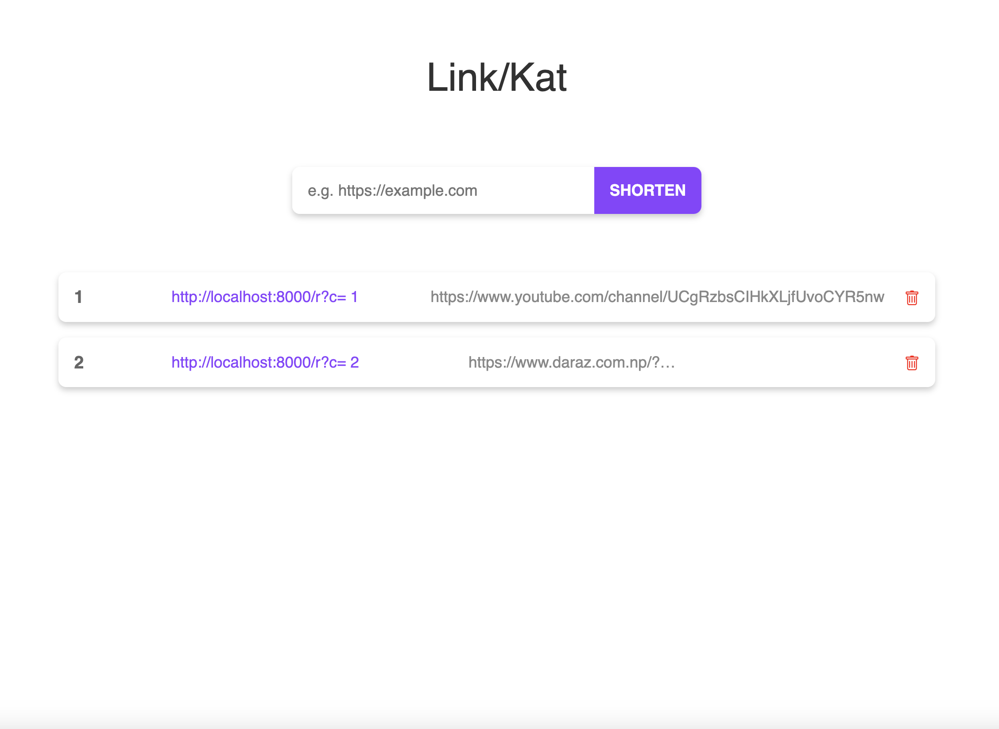

<a name="readme-top"></a>

[![Contributors][contributors-shield]][contributors-url]
[![Forks][forks-shield]][forks-url]
[![Stargazers][stars-shield]][stars-url]
[![Issues][issues-shield]][issues-url]
[![MIT License][license-shield]][license-url]
[![LinkedIn][linkedin-shield]][linkedin-url]

<!-- PROJECT LOGO -->
<br />
<div align="center">
<!--   <a href="#">
    
  </a> -->

  <h3 align="center">Link Kat</h3>

  <p align="center">
    Link Kat is a simple web application for shortening URLs effortlessly. It allows users to paste long URLs and generate shorter, more manageable links.
    <br />
    <a href="https://github.com/andipstha/Link-kat"><strong>Explore the docs »</strong></a>
    <br />
    <br />
    <a href="https://github.com/andipstha/Link-kat">View Demo</a>
    ·
    <a href="https://github.com/andipstha/Link-kat/issues">Report Bug</a>
    ·
    <a href="https://github.com/andipstha/Link-kat/issues">Request Feature</a>
  </p>
</div>


## Features

- Shorten long URLs quickly
- Paste and transform URLs into compact links
<!--
## Technologies Used

- PHP
- MySQL
- HTML
- CSS (with Bootstrap for styling)
- JavaScript (optional, for client-side interactivity)
-->
## Setup

1. **Clone the repository:**

    ```bash
    git clone https://github.com/your-username/link-kat.git
    ```

2. **Database Setup:**

    - Import the included SQL file (`link_kat.sql`) into your MySQL database management tool (e.g., MySQL Workbench) to set up the necessary tables.
    - Open your MySQL database management tool and connect to your database server.
    - Import the `link_kat.sql` file into your database.
    - Update `db.php` with your database credentials.

3. **Run the Application:**

    - Start your local server (e.g., Apache, Nginx).
    - Open the project folder in your web server's directory.
    - Access the application through your web browser.

## Usage

1. **Shorten URL:**

    - Paste your long URL into the input field.
    - Click on the "Shorten" button to generate a shortened link.

2. **Copy Shortened URL:**

    - Once the URL is shortened, you can copy the generated link.

3. **Delete URL:**

    - Click on the "Delete" button next to the shortened URL to remove it from the list.
<!-- 3. **Edit URL:**

    - Click on the "Edit" button next to the shortened URL to make changes.
    - Update the URL details and click on the "Save" button.

 -->

## Contributing

Contributions are welcome! Feel free to open an issue or submit a pull request with any improvements or feature suggestions.

## Screenshots

 


<!-- MARKDOWN LINKS & IMAGES -->
[contributors-shield]: https://img.shields.io/github/contributors/andipstha/Link-Kat.svg?style=for-the-badge
[contributors-url]: https://github.com/andipstha/Link-Kat/graphs/contributors
[forks-shield]: https://img.shields.io/github/forks/andipstha/Link-Kat.svg?style=for-the-badge
[forks-url]: https://github.com/andipstha/Link-Kat/network/members
[stars-shield]: https://img.shields.io/github/stars/andipstha/Link-Kat.svg?style=for-the-badge
[stars-url]: https://github.com/andipstha/Link-Kat/stargazers
[issues-shield]: https://img.shields.io/github/issues/andipstha/Link-Kat.svg?style=for-the-badge
[issues-url]: https://github.com/andipstha/Link-Kat/issues
[license-shield]: https://img.shields.io/github/license/andipstha/Link-Kat.svg?style=for-the-badge
[license-url]: https://github.com/andipstha/Link-Kat/blob/master/LICENSE.txt
[linkedin-shield]: https://img.shields.io/badge/-LinkedIn-black.svg?style=for-the-badge&logo=linkedin&colorB=555
[linkedin-url]: https://linkedin.com/in/andipstha
[product-screenshot]: images/screenshot.png
[Next.js]: https://img.shields.io/badge/next.js-000000?style=for-the-badge&logo=nextdotjs&logoColor=white
[Next-url]: https://nextjs.org/
[React.js]: https://img.shields.io/badge/React-20232A?style=for-the-badge&logo=react&logoColor=61DAFB
[React-url]: https://reactjs.org/
[Vue.js]: https://img.shields.io/badge/Vue.js-35495E?style=for-the-badge&logo=vuedotjs&logoColor=4FC08D
[Vue-url]: https://vuejs.org/
[Angular.io]: https://img.shields.io/badge/Angular-DD0031?style=for-the-badge&logo=angular&logoColor=white
[Angular-url]: https://angular.io/
[Svelte.dev]: https://img.shields.io/badge/Svelte-4A4A55?style=for-the-badge&logo=svelte&logoColor=FF3E00
[Svelte-url]: https://svelte.dev/
[Laravel.com]: https://img.shields.io/badge/Laravel-FF2D20?style=for-the-badge&logo=laravel&logoColor=white
[Laravel-url]: https://laravel.com
[Bootstrap.com]: https://img.shields.io/badge/Bootstrap-563D7C?style=for-the-badge&logo=bootstrap&logoColor=white
[Bootstrap-url]: https://getbootstrap.com
[JQuery.com]: https://img.shields.io/badge/jQuery-0769AD?style=for-the-badge&logo=jquery&logoColor=white
[JQuery-url]: https://jquery.com 

